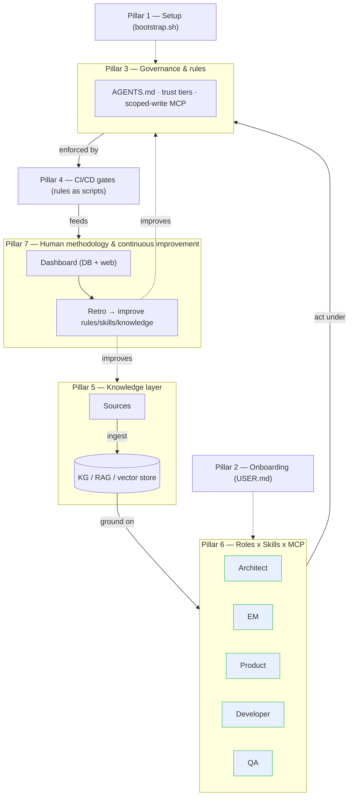

# AI-SDLC Bootstrap Kit — Specification

**Status:** approved · **Version:** 1.0 · **Last reviewed:** 2026-06-26

This document specifies the kit: what it is, the model it encodes, every artefact it ships, the data contracts those artefacts obey, and how a project is bootstrapped from it. It is the source of truth for the visuals ([`visuals/`](./visuals/)) and the deck ([`presentation/`](./presentation/)).

---

## 1. Purpose

Give any software project a **ready-made, governed operating model for working with AI agents across the whole SDLC** — so that, on day one, AI is a first-class collaborator that is *grounded* (answers from project knowledge), *attributable* (every load-bearing change has a named human seat), and *gated* (rules are enforced as CI), with a *human-owned* loop that keeps quality and cost honest.

The kit is the generalised, project-agnostic distillation of a real programme's governance setup, aligned to a brainstormed whiteboard model (*AUTOMATIZARE*).

### 1.1 From whiteboard to kit

The originating whiteboard maps directly onto the kit:

| Whiteboard element | Kit realisation |
|---|---|
| *Sources → ingest → Knowledge Graph / RAG / VectorDB* | Pillar 5 — `docs/knowledge/` + `scripts/knowledge/ingest.py` |
| *Rol 1/2/3 → Skill + MCP* (the matrix) | Pillar 6 — `.claude/skills/playbook-<seat>` + `.mcp.json` |
| ① *Onboarding* | Pillar 2 — `ONBOARDING.md` |
| ② *Governance & internal rules* | Pillar 3 — `AGENTS.md`, `WORKING-AGREEMENT.md`, `docs/ai-context/` |
| ③ *CI/CD for AI — rules (scripts)* | Pillar 4 — `.github/workflows/`, `scripts/validate-*.py` |
| ④ *Dashboard utilization (DB + web)* | Pillar 7 (visible half) — `dashboard/` |
| ⑤ *HUMAN — Methodology / Cost improvement* | Pillar 7 — `docs/methodology/continuous-improvement.md` |
| ⑥ *Setup* | Pillar 1 — `scripts/bootstrap.sh` |
| *Repo → Edit → Pull Request* (right side) | The session ritual — `scripts/session/` + commit hook |

---

## 2. The seven-pillar model



A pillar is included only if it removes a recurring real question (the **anti-bloat clause**). Each is specified below.

### Pillar 1 — Setup
`scripts/bootstrap.sh` copies the template into a target dir, substitutes `<PLACEHOLDERS>`, `git init`s, commits, and installs hooks. Idempotent-ish (refuses a non-empty target without `--force`). Inputs: `--name --slug --dir --desc --ticket --host`.

### Pillar 2 — Onboarding
`ONBOARDING.md` is loaded by an agent **only when `USER.md` is missing**. It detects the OS, installs prerequisites, activates hooks, optionally seeds the knowledge index, gathers identity + seat + comms preferences, and writes the git-ignored `USER.md`. Failures are recorded in `USER.md`'s *Onboarding status* for automatic retry next session.

### Pillar 3 — Governance & rules
`AGENTS.md` is the **single canonical brief** every tool reads; `CLAUDE.md` is a thin pointer that may not carry unique content. Governs: trust tiers, the frontmatter contract, the scoped-write MCP posture, seats, languages, deliverable rules. `WORKING-AGREEMENT.md` covers tool ownership, lifecycle, and the session ritual. `docs/ai-context/README.md` is the day-to-day expansion.

### Pillar 4 — CI/CD for the AI framework
Rules expressed as scripts, enforced as gates:
- `scripts/validate-skills.py` — every `SKILL.md` conforms to agentskills.io.
- `scripts/validate-frontmatter.py` — every governed doc carries the maturity/trust frontmatter.
- `scripts/git/commit_msg_ticket.py` — commits reference an issue key.
Local feedback via `.pre-commit-config.yaml`; the enforced merge gate is `.github/workflows/ai-governance.yml`.

### Pillar 5 — Knowledge layer
Sources under `docs/knowledge/sources/` (frontmatter per `docs/knowledge/schema.md`) are ingested by `scripts/knowledge/ingest.py` into a git-ignored local index. The stub is dependency-light (chunk + keyword search) with a documented upgrade path to embeddings + a vector store, or a hosted `knowledge` MCP server. Agents **ground** answers on it and cite the source's trust tier.

### Pillar 6 — Roles × Skills × MCP
Five named seats — Architect, EM, Product, Developer, QA — each with:
- an **invokable** role-contract skill (`.claude/skills/playbook-<seat>/SKILL.md`): owns / co-owns / doesn't-touch, decision rights, cross-seat interactions, and *how it works with AI*;
- a **scoped MCP profile** (`.mcp.json`): which connectors it uses and how.
Read-on-demand connector playbooks live in `docs/ai-context/skills/<role>/`.

### Pillar 7 — Human methodology & continuous improvement
`dashboard/` (Streamlit + SQLite) surfaces a small, stable metric set — sessions, acceptance rate, rework rate, **cost per accepted unit**, grounding rate. `docs/methodology/continuous-improvement.md` defines the retro loop that turns those metrics into PRs against the rules, skills, and knowledge. Promotion, sign-off, and curation stay human.

---

## 3. The session ritual (Repo → Edit → Pull Request)

```mermaid
sequenceDiagram
    participant H as Human (seat)
    participant AI as AI agent
    participant Repo as Git repo
    H->>AI: open session
    AI->>Repo: start.sh — print identity/branch/sync, confirm SEAT
    AI->>AI: ground on knowledge layer (pillar 5)
    AI->>Repo: edit on a branch (frontmatter: owner=seat, author=git)
    AI->>Repo: pre-commit gates (skills, frontmatter, commit key)
    H->>AI: wrap up
    AI->>Repo: wrapup.sh — commit + push branch + open PR
    Note over Repo: AI never pushes a protected branch; merge is human-reviewed
```

---

## 4. Data contracts

### 4.1 Frontmatter (governed Markdown) — `AGENTS.md` §4.2
Required: `title`, `status` ∈ {draft, under-review, approved, superseded}, `owner` (seat), `classification` ∈ {public, internal, restricted}, `ai-trust` ∈ {authoritative, working, exploratory}. Recommended: `author`, `created`, `last-reviewed`. Enforced by `validate-frontmatter.py` (relaxed in `drafts/`, `received/`, `knowledge/`).

### 4.2 Trust tiers
Authoritative (cite directly) · Working (cite + status flag) · Exploratory (read only if named) · Restricted (path-referenced request only). Naming a path is explicit.

### 4.3 Scoped-write MCP posture
| Surface | AI may | Human applies |
|---|---|---|
| Issue tracker | create/modify items under a seat | reviewed in-tool |
| Docs/wiki | write drafts | promotion to canonical |
| Knowledge store | ingest & query | curation/deletion |
| Git host | branches/PRs | merge to protected branch |

### 4.4 Knowledge schema — `docs/knowledge/schema.md`
Source frontmatter carries `ai-trust`; the index stores `{source, tier, chunk, text}` per chunk (+ `embedding` in production).

### 4.5 Skill spec
agentskills.io: `name` (== dir), `description` (the trigger signal), optional `metadata` (string→string), `license`, `compatibility`, `allowed-tools`.

### 4.6 Dashboard schema — `dashboard/schema.sql`
`sessions(ts, seat, tool, task, ticket, tokens_in, tokens_out, cost_usd, outcome, grounded, notes)`.

---

## 5. Artefact inventory

| Area | Files |
|---|---|
| Brief & governance | `AGENTS.md`, `CLAUDE.md`, `WORKING-AGREEMENT.md`, `ONBOARDING.md`, `README.md`, `FOLDER-INDEX.md`, `INDEX.md`, `USER.md.example`, `.gitignore`, `.mcp.json`, `.pre-commit-config.yaml`, `.claude/settings.json` |
| Skills | `.claude/skills/README.md` + `playbook-{architect,em,product,dev,qa}/SKILL.md` + `skill-creator/SKILL.md` |
| CI | `.github/workflows/{ai-governance,docs}.yml`, `mlc-config.json` |
| Scripts | `scripts/bootstrap.sh`, `validate-skills.py`, `validate-frontmatter.py`, `session/{start,sync,wrapup}.sh` + `config`, `git/commit_msg_ticket.py`, `knowledge/ingest.py` |
| Knowledge tree | `docs/{ai-context,architecture/decisions,governance,knowledge,onboarding,methodology,received,drafts}/…` |
| Dashboard | `dashboard/{app.py,schema.sql,requirements.txt,README.md}` |

---

## 6. Acceptance criteria

1. `validate-skills.py` and `validate-frontmatter.py` pass on the shipped template. ✅
2. `knowledge/ingest.py --build` and `--query` work with no external services. ✅
3. `bootstrap.sh` produces a git repo with placeholders substituted and hooks installed.
4. Every pillar has at least one runnable or enforceable artefact (not just prose).
5. No project-specific facts leak into the template — only `<PLACEHOLDERS>`.

---

## 7. Extension points

- **Knowledge:** swap keyword search for embeddings + a vector store, or wire a hosted `knowledge` MCP.
- **CI host:** the gates are plain scripts — add a GitLab/Bitbucket pipeline that calls the same scripts.
- **Seats:** add or merge a seat = add a `playbook-<seat>` skill + an MCP profile entry.
- **Dashboard:** SQLite → Postgres; add a hosted web front-end reading the same schema.
- **Generic baseline skills:** bundle `brainstorming`, `writing-plans`, `tdd`, etc. into `.claude/skills/`.
