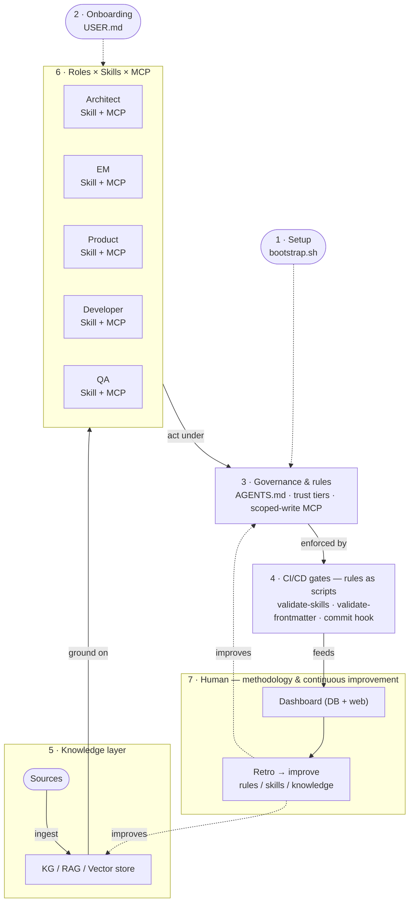
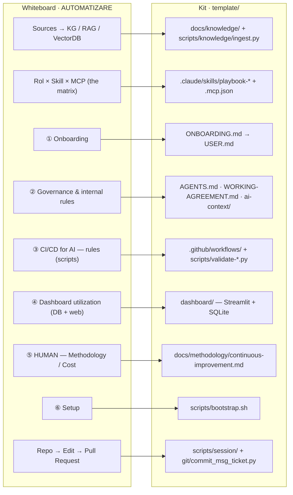

# Visuals

Framework diagrams for the AI-SDLC Bootstrap Kit.

| File | What it shows |
|---|---|
| [`ai-sdlc-framework.excalidraw`](./ai-sdlc-framework.excalidraw) · [PNG](./ai-sdlc-framework.png) | The hero diagram — the seven-pillar architecture and how the pieces connect. |
| [`board-to-kit.excalidraw`](./board-to-kit.excalidraw) · [PNG](./board-to-kit.png) | The *AUTOMATIZARE* whiteboard mapped to where each idea lives in `template/`. |

**Editing `.excalidraw` files:** open them at [excalidraw.com](https://excalidraw.com) (File → Open) or with the *Excalidraw* VS Code extension. The PNGs are exports for quick viewing — re-export after editing.

The GitHub-native Mermaid versions below render inline without opening Excalidraw.

## Seven-pillar architecture

## From whiteboard to kit

